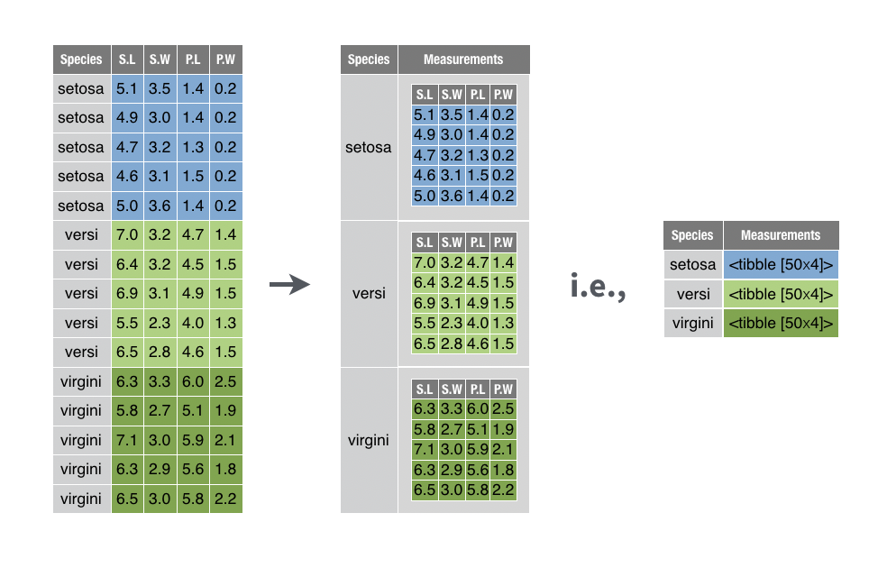

# Required Data Format

* __Requirements__
  + Each row should represent the number of individuals enumerated for a single taxon collected during a single sampling event.
  + There should be columns representing:
    + a unique ID for a sampling event (i.e., key)
    + taxonomic counts
    + various taxonomic ranks (e.g., individual columns for order, family, genus)
    + various taxonomic groups (e.g., tolerance values and functional feeding groups)

## Required Data Format Example

The example data set represents the benthic macroinvertebrates collected in the Northern Appalachians as part of the 2008-2009 National Rivers and Streams Assessment (NRSA) conducted by the United States Environmental Protection Agency.
```{r req_data_load, echo=FALSE}
data("nrsa_nap_0809", package = "mmir")

nrsa_nap_0809 %>% 
  standard_dt()
```


## Data Preparation for Integration with dplyr

Prepare the data for metric calculation.
```{r req_data_nest}
nest.df <- nrsa_nap_0809 %>% 
  dplyr::group_nest(uid, rt_nrsa_cat, .key = "data") 
```

```{r req_data_tbl, echo=FALSE}
nest.df %>% 
  standard_dt()
```


{width=1000px}

Grolemund, Garret. 2019. The Tidyverse Cookbook. https://www.google.com/url?sa=i&url=https%3A%2F%2Frstudio-education.github.io%2Ftidyverse-cookbook%2Ftransform-tables.html&psig=AOvVaw1NPuLqh0wRg-HLOJ79PeK6&ust=1583514049818000&source=images&cd=vfe&ved=0CAIQjRxqFwoTCLCFtNvng-gCFQAAAAAdAAAAABAU

