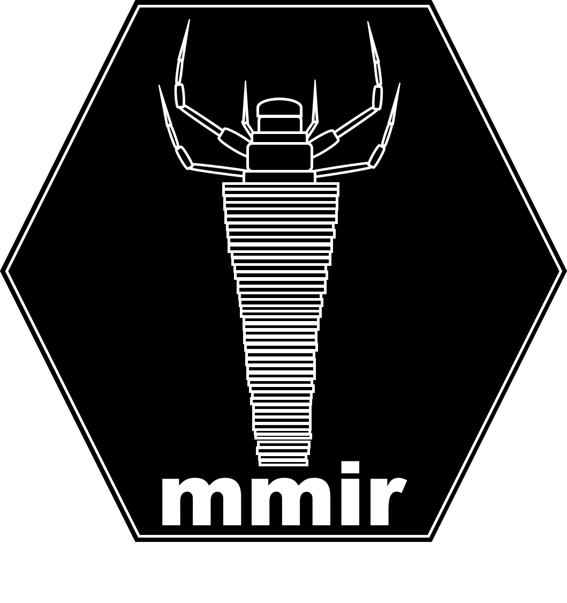

# mmir

{width=500px}

```{r, echo=FALSE}
standard_dt <- function(x) {
    DT::datatable(x, 
    options = list(
      columnDefs = list(list(
        className = 'dt-center'
      )),
      scrollY = 300,
      scroller = TRUE,
      scrollX = TRUE
    )
  )
}
  
```

